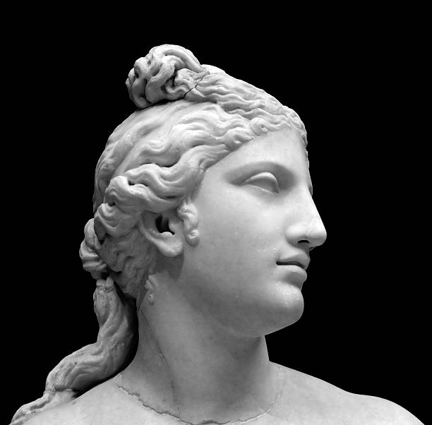

:doc:`Home Page </index>`

Aphrodite
=========

Aprhodite is known as the Greek goddess of beauty, love, pleasure, and 
procreation. Ancient Greeks say that Aphrodite also inspired homosexual 
male desire. Aphrodite is, most of the time, depicted as a very beautiful woman 
with long hair and a small amount of clothing (take into consideration that 
such was acceptable and widely used in art in ancient Europe). There were also 
ancient cities that worshipped a **male** form of Aphrodite.

Birth of Aphrodite
~~~~~~~~~~~~~~~~~~
There are, according to myth, two different forms of Aphrodite. One of the two 
forms of Aphrodite was born form the foam of Uranus' genitals after Cronus had 
castrated him and cast them into the sea. Aphrodite's name can be interpreted as
"foam-arisen", hence her origin story. The latter, also called Aphrodite's 
"celestial" form, is the older form of Aphrodite. Aphrodite has a younger form 
(separate from the celestial form), which was produced from the union of Zeus 
and Dione. This form of Aphrodite inspired love for all women.

Children of Aphrodite
~~~~~~~~~~~~~~~~~~~~~
Aphrodite was bound by marriage to the god Hephaestus but was said to have had 
very many lovers aside from her husband. Aphrodite had no children with
Hephaestus but mothered many other children including:

============= ====================
Father        Child
============= ====================
Ares          ``Anteros``
Ares          ``Deimos``
Ares          ``Eros``
Ares          ``Harmonia``
Ares          ``Phobos``
Adonis        ``Priapos``
Adonis        ``Beroe``
Hermes        ``Hermaphroditos``
Hermes        ``Iakkhos``
Poseidon      ``Rhodos``
============= ====================

Symbols of Aprhodite
~~~~~~~~~~~~~~~~~~~~

Aphrodite's has many symbols compared to other gods and goddesses. Her symbols
are as follows:

* Scallop Shell
* Pearl
* Mirror
* Girdle
* Rose
* Pomegranate
* Dove, Sparrow, and Swan

:doc:`Home Page </index>`
