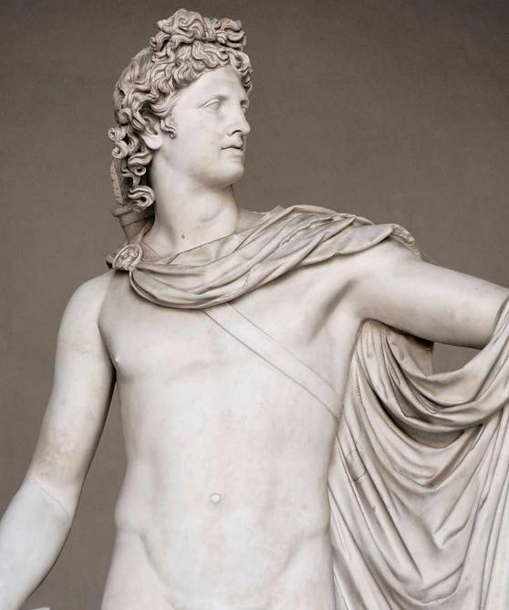
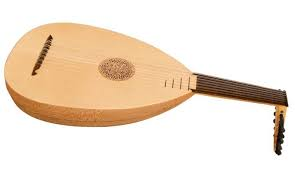
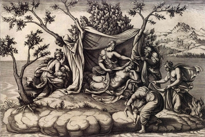

:doc:`Home page </index>`

Apollo
======

Apollo is the Greek god of music, the Sun, medicine (and plague), knowledge, 
archery, and light. He has an older twin sister named Artemis, the goddess of 
wilderness and the hunt. Apollo is described as having a slimming, but very fit 
physique and a youthful face, so in most of his depictions he never had a beard. 
He is also described as playing music throughout Olympus, as he always had his 
lyre with him. As he was one of the more intelligent Olympians, he was also 
known for teaching man the art of medicine, as well as punishing them with 
ill-health and plague. Fun fact: in Greek mythology, he invented the lute 
(a stringed instrument similar to a guitar). 

Birth of Apollo
~~~~~~~~~~~~~~~

Apollo is the offspring of Zeus, the Greek god of the sky and king of the gods, 
and the Titan Leto. He and his twin sister Artemis were both born on the Greek 
island of Delos. When Hera (Zeus' wife) found out that Zeus impregnated Leto, 
Hera banned her from giving birth on land. The island wasn't considered an 
official island, but the local inhabitants on the island helped Leto give birth 
to Apollo and Artemis (who had born a day earlier). In return for helping her, 
Leto promised the island's inhabitants that Apollo would always favor them. 

Apollo's Children
~~~~~~~~~~~~~~~~~
.. image:: apollo4.jpg
    :width: 50%

Like his father, Apollo had many offspring. There were his divine (immortal) 
offspring, such as Aristaeus, god of beekeeping and olive oil manufacturing 
(mother is the nymph Kyrene), Asclepius, god of medicine (mother is Koronis), 
and even a monstrous sea-nymph who, according to some legend, is the daughter 
of Apollo and Hecate. Apollo had much more mortal offspring, but some of the 
most noticable are Ileus, a lord of Troy (mother of the nymph Ourea), and 
Orpheus,  the famous hunter and musician of Greek legend (mother was the Mousa 
Kalliope). 

Apollo's Symbols
~~~~~~~~~~~~~~~~
Apollo is symbolized by the following:

1. The lyre
2. The bow and arrow 
3. The common raven 
4. The python 
5. The laurel wreath 

More info about Apollo can be found here: 
`Apollo <https://www.greekmythology.com/Olympians/Apollo/apollo.html>`_

:doc:`Home page </index>`