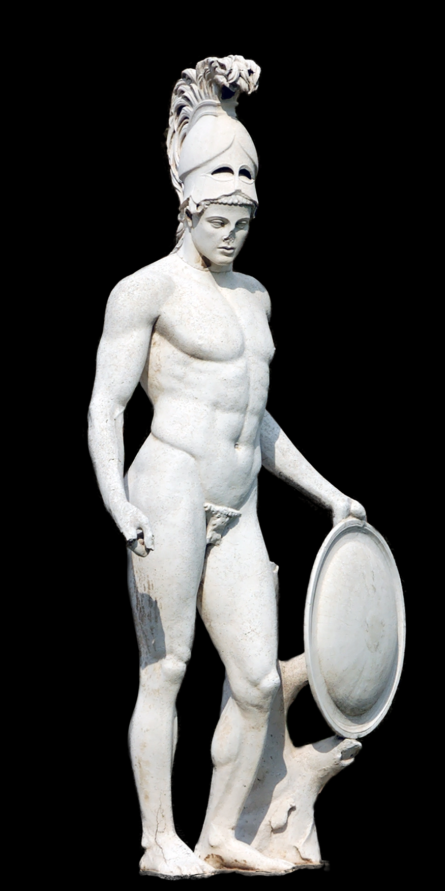
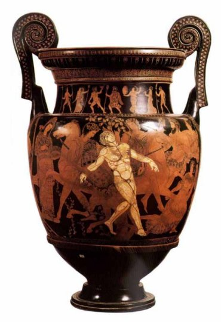
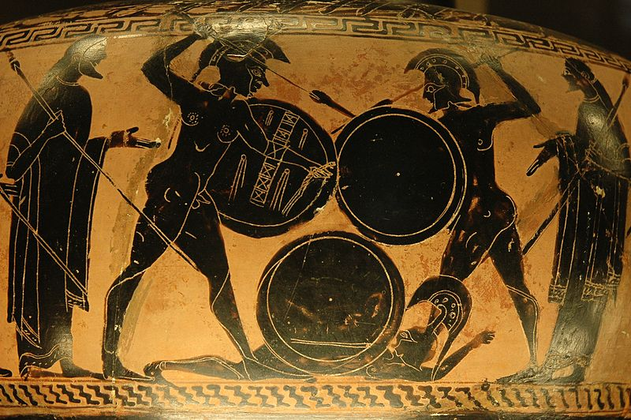

.. //Matt Rockhold//
:doc:`Home page </index>`

Ares
====

Ares is the Greek god of war, violence, and bloodshed. He was often depicted to 
sport a spear and helmet with his armor. Ares was associated with the more 
unpleasant side of war, as oppose to his counterpart Athena, who represented 
military strategy and intelligence. He was associated with all of these 
attributes to war and towards the necessary aggression of battle, many of the 
Olympians found him to be hostile and were rather not pleased by his presence. 
Even in the mortal world man did not worship Ares as they did the other Greek 
gods. 

The Birth of Ares
~~~~~~~~~~~~~~~~~

Ares was the son Zeus and Hera. In some ancient Greek 
stories, Hera had Ares without the aid of Zeus by using a magical herb. While 
Ares was still a new-born infant, he was captured by two giants and was placed 
in a bronze jar. He would've been trapped in there forever had not the giants' 
mother found out and told the Greek god Hermes, who would later rescue Ares. 
Ares would later grow up to be a blood-thirsty god whose main pleasure was 
watching people fight and kill each other. Ares would later kill Poseidon's son
Halirrhothius, for assaulting Alcippe, a daughter of a war-god. This would cause 
Poseidon to hate Ares and it caused many of the other gods in Olympus to hate 
him as well. Of all of Zeus' children, Ares was his least favorite. 

Ares' Children
~~~~~~~~~~~~~~

Ares had many immortal children, such as Hippolyta, who was Queen of the Amazons
and it would be later believed that all of the Amazonions were Ares' children. 
Perhaps one of the most infamous affairs of Ares (and in Greek mythology) was 
with Aphrodite, with whom he had many children. Aphrodite was originally married
to Hephaestus, but began this affair with Ares. When Hephaestus found out about 
this affair, he placed them in front of the other Greek gods of Olympus by 
trapping them in a strong (but invisible net) that he forged, where they would 
then be mocked and ridiculed by the other gods. Here is a short list below to 
see the other children that Ares had (mainly with Aphrodite):

============= ====================
Mother        Child
============= ====================
Aphrodite     ``Anteros``
Aphrodite     ``Deimos``
Aphrodite     ``Eros``
Aphrodite     ``Harmonia``
Aphrodite     ``Phobos``
Aphrodite     ``Himeros``
Aphrodite     ``Adrestia``
Unknown       ``Hippolyta``
Erytheia      ``Eurytion``
============= ====================

Ares vs. Hercules
~~~~~~~~~~~~~~~~~

Ares had many famous battles, which he usually won (I mean he's the god of War).
There was one famous Greek hero that Ares couldn't beat: Hercules. Hercules was 
the half-mortal son of Zeus who possessed great strength. One of Ares' sons, 
Kyknos, was infamous for slaying pilgrims on their way to the Oracle Delphi, 
which would anger the Sun god Apollo. Apollo sent Hercules to kill Kyknos, which
enraged Ares, who sought to slay Hercules. Hercules was protected by Athena in 
the battle, so Hercules had the upper hand, and even managed to hurt Ares 
physically. Hercules ended up being the victor of the fight. 

Ares' Symbols
~~~~~~~~~~~~~
Ares is symbolized by the following: 

* The spear and helmet 
* The hound 
* The vulture  

More info about Ares can be found here: 
`Ares <https://www.greekmythology.com/Olympians/Aris/aris.html>`_

:doc:`Home page </index>`