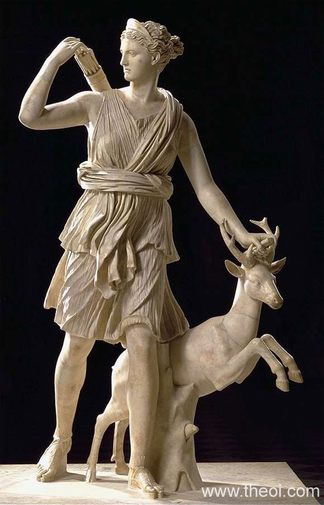
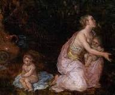
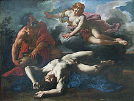

.. //Matt Rockhold//
:doc:`Home page </index>`

Artemis
=======

Artemis is the virgin Greek goddess of chastity, wilderness, archery, and the 
hunt. She is also the older twin sister of Apollo. She was known as a fierce 
hunter, but also a caring source for women that suffered the affects of child 
birth. As she was the virgin goddess, she never had any children, and she was 
very serious when it came to her chastity (which many of the Greek gods tried 
to rid her of). 

Birth of Artemis
~~~~~~~~~~~~~~~~

Like her twin brother Apollo, she is the daughter of Greek god Zeus and the 
Titan Leto. She was born on the island of Delos after Hera had banned Leto from 
giving birth of land when she found out that Zeus, her husband, had impregnated 
Leto. A day after she was born she had to help assist her mother with giving 
birth to her twin brother Apollo. When Artemis' birth, it is rumored in Greek 
mythology that when she was a child she sat in Zeus' lap and asked him six 
wishes: 

1. To always remain a virgin. 

2. To have a bow and arrow and a knee-length 
tunic to hunt in. 

3. To have many names to set her apart from her twin brother 
Apollo.

4. To be ther Phaesporia (light bringer).

5. To have sixty "daughters of 
Okeanos" (nine years of age) to be her choir.

6. To have twenty Amnisides Nymphs to 
be her handmaidens to watch her dogs 
and bow while she rested.

Artemis and Orion
~~~~~~~~~~~~~~~~~

Artemis had met Orion (son of Poseidon) in the woods one day and they were both
attracted to each other by their great beauty. They both were also great hunters
and soon became great friends and allies to each other. Apollo (Artemis' twin
brother) saw this friendship that Artemis was having with Orion and became angry 
because he thought that Artemis would break her oath of chastity and marry 
Orion. Apollo then hatched up a plan by making a scorpion that had appeared in 
one of Orion's dreams to appear at his bed side and kill him. Orion tried to 
fend off the giant scorpion but could not kill it, so he dove into the sea onto 
the water (because he could walk on water). Apollo saw him out in the ocean and 
challenged Artemis to a game of sharpshooting with their bows, so Artemis the 
black speck out in the open water, which to her surprise, was Orion. She felt 
ashamed once she knew that she had fallen for Apollo's trick.  

Artemis' Symbols 
~~~~~~~~~~~~~~~~

Artemis is usually symbolized by the following: 

*  The moon 
*  The bow and arrow 
*  The hunting dog 

More info about Artemis can be found here: 
`Artemis <https://www.greekmythology.com/Olympians/Artemis/artemis.html>`_

:doc:`Home page </index>`