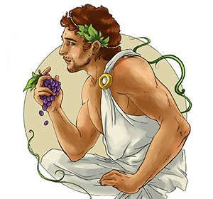
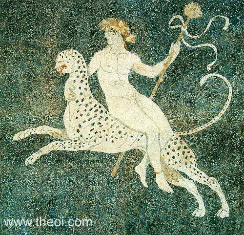
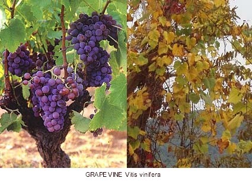

Dionysus
========

Dionysus is the God of wine, vegetation, pleasure, madness, and a few other 
things. He was known as the "twice born" because his mother was killed and his
father carried him to term. Dionysus was depicted as being either an old bearded
 man or a young effeminate youth. 

Background
~~~~~~~~~~

Dionysus was a son of Zeus and Semele of Thebes. When she was pregnant, Hera 
(Zeus' jealous wife) tricked her into asking Zeus to show her his power. Since 
Semele was a mortal, she was consumed by the heat of his lightning bolts. Zeus 
recovered the unborn child and stitched him into his own thigh until Dionysus 
was born. After his birth, Hera hired Titans to kill him. He was killed and 
brought back to life, then was sent to be raised by the mountain nymphs. 
Dionysus eventually wandered the world expanding his group of followers. 

Family of Dionysus
~~~~~~~~~~~~~~~~~~

*Parents: Zeus, the King of Gods and the princess Semele.
*Wife: Ariadne, the princess of Crete.
*Children: Dionysus had 20+ children, both devine and mortal. The most notable 
were Priapus, Phthonus, and Deianira.

Followers of Dionysus
~~~~~~~~~~~~~~~~~~~~~

Rather than worshiping him at a temple like most Gods, Dionysus' followers went 
to the woods. They would enter a state of madness and try to rip apart and eat 
any wild animal they could find. 

Attributes
~~~~~~~~~~

Dionysus carried a thyrsos, which is a pine-cone tipped staff. He also held a 
drinking cup and wore a crown of ivy. He was usually accompanied by his wild
female devotees, Satyrs and Mainades.

Sacred Animals and Plants
~~~~~~~~~~~~~~~~~~~~~~~~~

Dionysus' sacred animals included the panther/leopard, tiger, bull, and serpent.
He either rode on the back of a panther or on a chariot pulled by a pair of 
panthers. His sacred plants were grapevine, ivy, bindweed, and pine tree. Those
who worshiped Dionysus wore wreaths of ivy and carried thyrsos.

