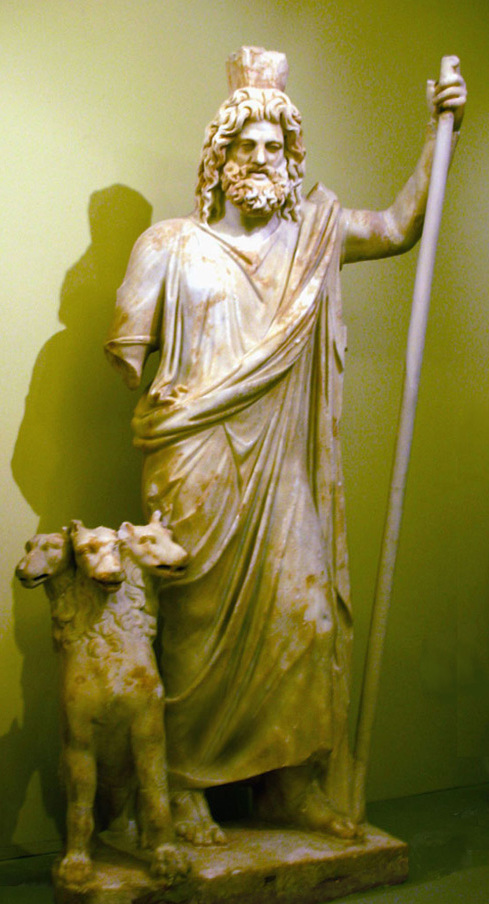

:doc:`Home Page </index>`

Hades
=====

Hades is known as the god of the underworld and one of the brothers of 
:doc:`Zeus </zeus/index>` and :doc:`Poseidon </poseidon/index>`. After 
Zeus and Poseidon  defeated what were known as the titans, Zeus was given the 
sky, Poseidon was given the sea, and Hades was left with the Underworld. Hades 
is also known to have his three headed dog by his side in the Underworld, 
Cerberus.

The Underworld
~~~~~~~~~~~~~~

According to ancient Greek myth, the realm of Hades is misty and gloomy; a 
place where the dead roam and where all mortals go when they perish. Once 
mortals entered the Underworld they were transported by ferry across the
river Styx by `Charon <http://www.theoi.com/Khthonios/Kharon.html>`_
(ferryman of Hades) where they would meet Cerberus on the 
shore. After passing by Cerberus the spirits would proceed into the 
Underworld to be judged. It is said that some spirits were returned to the 
surface to haunt those who had not given them a proper burial. Below is a map of
what the Underworld was believed to look like.

Hades' Children
~~~~~~~~~~~~~~~

According to myth, Hades was married to Persephone (daughter of 
Zeus, Queen of the Underworld). Most myths tell of Hades having no children with 
his wife Persephone or any other potential lovers. Persephone did not willingly
marry Hades. She was abducted by Hades whilst picking flowers.

Hades' Symbols
~~~~~~~~~~~~~~

Hades' symbols:

* Cerberus
* Drinking Horn
* Scepter
* Cypress
* Narcissus
* Key

More information about Hades can be found here: 
`Hades <https://www.greekmythology.com/Olympians/Hades/hades.html>`_

:doc:`Home Page </index>`