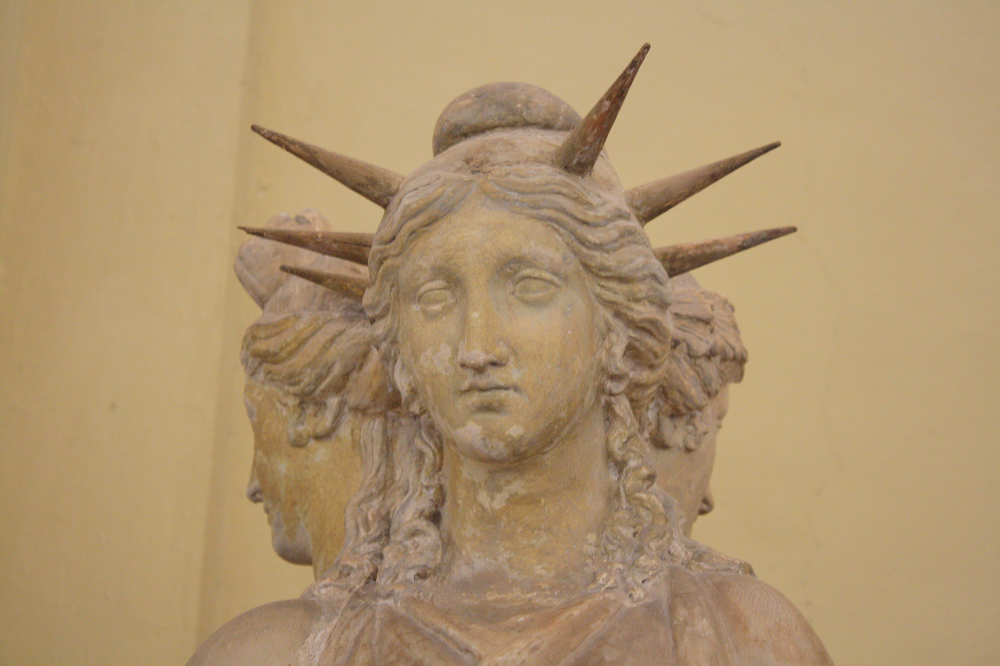
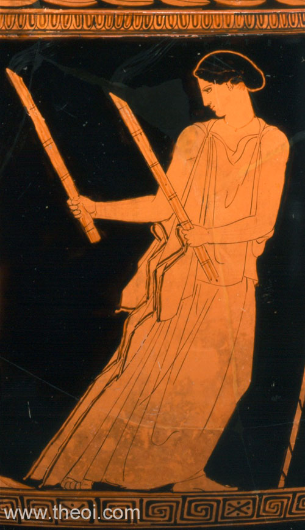

.. //Drew Cummings//
:doc:`Home Page </index>`

Hecate
======

Hecate is the goddess of magic, witchcraft and spirits. Hecate is often 
portrayed as a woman holding two torches and wearing a maiden’s skirt and 
hunting boots. Another depiction for her is a goddess with tree faces and 
bodies, one of a young maiden then next and a mother figure and the last as a 
crone. Hecate is also associated with crossroads, doorways and realms beyond 
the world resulting in her dealing with spirits and Hades. She is also a virgin 
goddess like others namely :doc:`Artemis </artemis/index>`, 
:doc:`Athena </athena/index>` and :doc:`Hestia </hestia/index>`. When 
Persephone went missing Demeter came and asked Hecate to help her search and 
she did just that. Guiding Demeter with two torches in hand she leads her to 
Persephone and into Hades. After their reunion Hecate became Persephone’s 
companion in Hades. Hecate is a goddess of protection especially of women, 
whenever they travel or are in labor she watches over them. She also helps the 
elderly to make a smooth transition to the afterlife.

============= ===============
Moon Phase    Physical Form
============= ===============
Waxing Moon   ``Maiden``
Full Moon     ``Mother``
Waning Moon   ``Crone``
============= ===============

Birth of Hecate
~~~~~~~~~~~~~~~~~~~

She is the daughter of Titanes Perses and Asteria receiving her power over 
heaven, earth, and sea from them. She is also the only child from her parents.

Hecate's Symbols
~~~~~~~~~~~~~~~~~~~~

* Two torches
* A key
* Black dog
* Polecat

:doc:`Home Page </index>`