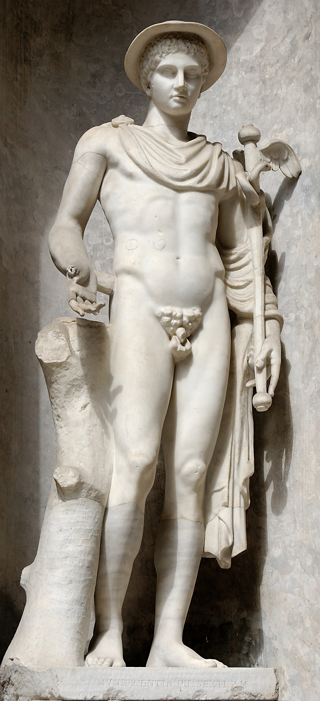
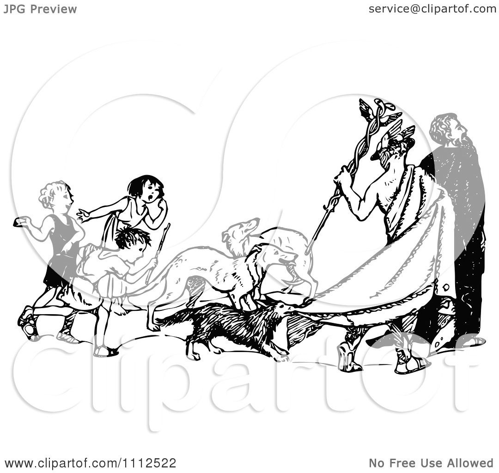

.. //Matt Rockhold//
:doc:`Home page </index>`

Hermes
======

Hermes is the Greek god of travel, trade, thievery, and Messenger of the 
Gods. He is usually either depicted as a young, athletic, beardless youth or as 
an older, bearded man with winged boots and a herald's wand. He was the Herald 
and personal messenger of Zeus, king of the Greek gods and Hermes' father, and 
also the guide of the dead who lead souls down into the underworld. 

Birth of Hermes
~~~~~~~~~~~~~~~

Hermes is the son of Zeus and Maia. Maia was the daughter of Atlas, a Titan, and 
Zeus snuck out to her cave on Mount Kyllene in the middle of the night to seduce 
her. Hermes was born ten months afterwards. Almost right afterwards, the 
new-born Hermes snuck out of his crib to steal some cattle from Apollo, and even
crafter the first lyre out of a tortoise shell. Hermes told Battus, a shepherd 
who saw him steal Apollo's cattle, not to tell anyone about his thievery. Battus 
told Apollo anyway. As a result, Hermes went to Battus and touched him with his 
staff, turning him into a stone. When Apollo found out he went to his father 
Zeus to complain about it, but Zeus was actually impressed by all that Hermes 
had done. As a simple punishment, Zeus forced Hermes to give Apollo his crafted
lyre. Zeus later invited Hermes to join the other Greek gods on Mount Olympus. 

Hermes' Children
~~~~~~~~~~~~~~~~

Like many other male Greek gods Hermes had many children. Many of them were 
immortal, like his son Pan (mother is Drypoe) who was half man, half goat but 
had great strength and speed. There was also Hermaphroditus (mother is 
Aphrodite). It is said that he was born with a body combining male and female 
sexes. The word "hermaphrodite" would be formed from this Greek origin. 

Hermes' Symbols
~~~~~~~~~~~~~~~
Hermes was symbolized by the following: 

* The winged sandals and helmet 
* The Cadeceus (staff)
* The tortoise 
* The hawk

More info about Hermes can be found here: 
`Hermes <https://www.greekmythology.com/Olympians/Hermes/hermes.html>`_

:doc:`Home page </index>`