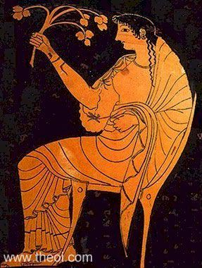

:doc:`Home Page </index>`

Hestia
======

.. image:: hestia.jpg
	:width: 35%

Hestia is the goddess of the hearth and home. She is also the goddess of 
sacrificial flame, then getting a part of every sacrifice to the gods. Very few 
special temples are specifically for Hestia but every pyrtaneum was a sanctuary 
for her. Hestia has often been portrayed as a modestly vailed woman that is 
sometimes holding a branch or with a kettle. The hearth was looked upon as the 
symbol for the center of domestic life, so Hestia was the giver of domestic 
happiness and blessings. She often appears next to 
:doc:`Hermes </hermes/index>` as a *deus penetralis*, for protecting the works 
of man. Hestia like :doc:`Athena </artemis/index>` and 
:doc:`Artemis </artemis/index>` are eternal virgins. After 
:doc:`Poseidon </poseidon/index>` and :doc:`Apollo </apollo/index>` were after 
her hand she swore on Zeus’s head that she would remain a virgin for all time. 
Honoring Hestia for her oath, :doc:`Zeus </zeus/index>` made Hestia in 
charge of his royal hearth.

Birth of Hestia
~~~~~~~~~~~~~~~~~~~

Hestia was the first born from Kronos and Rhea making her the first to be 
swallowed by Kronos. After Zeus forced Kronos to disgorge his siblings, Hestia 
was the last to be disgorged making her the oldest and the youngest of her 
siblings.

Hestia's Symbols
~~~~~~~~~~~~~~~~~~~~

* Kettle
* Pig
* Chaste-tree

:doc:`Home Page </index>`