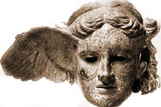
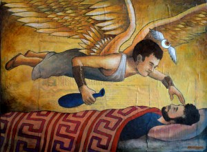

.. //Tucker Bluml//

:doc:`Home Page </index>`

Hypnos
======

Hypnos is the God of sleep. He lived in a cave with his twin brother, Thanatos, 
in the underworld. This place saw no light and was filled with sleep-inducing 
plants. The Lethe river (nicknamed "the river of forgetfulness") flowed through 
the cave. 

Family of Hypnos
~~~~~~~~~~~~~~~~

Hypnos was the son of Nyx (God of night) and Erebus (Goddess of darkness). This 
is a perfect combination of things to take a nap, so it's no wonder he is the 
God of sleep. His wife was Pasithea, one of the youngest of the Graces. She was 
given to him by Hera. Hypnos and Pasithea had three children, who were called 
Oneiroi, or "the dreams". Their names were Morpheus, Phobetor, and Phantasos.

Hypnos vs Zeus
~~~~~~~~~~~~~~

Hypnos was asked to put Zeus asleep by Hera. She had devised a plan to avenge 
the attack on Troy by Hercules, Zeus' son. While Zeus slept, Hera unleashed a 
storm on the seas where Hercules sailed. When Zeus woke up, he was very angry 
and tried to find Hypnos. The sneaky God of sleep had hidden with his mother. 
Hypnos was able to put Zeus to sleep yet again. He was reluctant at first, but 
Hera promised him Pasithea, his future wife. Hera did most of the work, wearing 
nice clothes and enchanting Zeus with her beauty. Hypnos snuck in and put him 
to sleep so Posiedon could help the Greeks in the Trojan War. Zeus never found 
out that he had been tricked again.

:doc:`Home Page </index>`