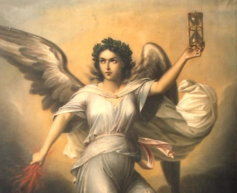
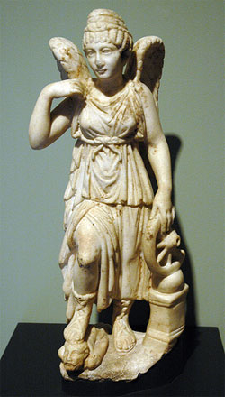

Nemesis
=======

Nemesis was the Goddess of divine retribution and revenge. She would show her 
wrath to any human who committed hubris - arrogance before the Gods. Because of 
her nature, she was widely used in Greek tragedies and other literary works. She 
was often called "Goddess of Rhamnous", an isolated place in Attica. It was 
there that a temple was built for her. 

Background
~~~~~~~~~~

Nemesis is generally believed to be the daughter of Nyx, the Goddess of Night. 
Her father, though rarely mentioned, is beleived to be Erebus, God of Darkness.
This parentage would make Nemesis a Goddess born of a generation that predates 
Zeus and the Gods of Mount Olympus. 

Attributes
~~~~~~~~~~

Nemesis is described as a beautiful maiden with wings to allow her to quickly 
travel to where she is needed. She went all over dealing with evil doers. She 
ensured a balance of happiness and sadness, good and bad, etc. Nemesis' symbol 
was a scale, which she used to measure how much fortune one deserves. If she 
feels that an individual has gotten more than his fair share, she brings out her 
lash and sword. Nemesis will sometimes carry a wheel, symbolizing how quickly 
fate can turn on you. People feared Nemesis, and her wrath is felt by the man 
under her foot in the image below:

