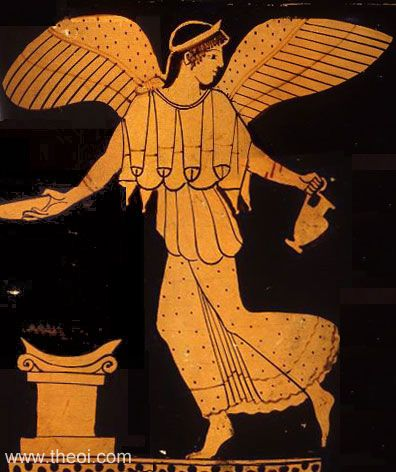
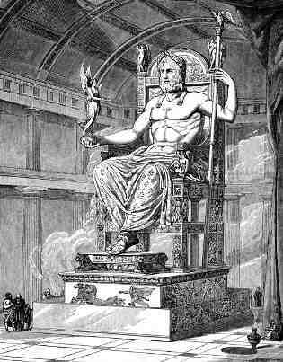

Nike
====

Nike is the Goddess of speed, strength, and victory in Greek Mythology. She was 
also referred to as Winged Goddess. Nike was worshiped by many because they 
believed that she could make them immortal and grant them the strength and speed 
needed to be victorious in every battle. 

Family of Nike
~~~~~~~~~~~~~~

Nike was the child of Pallas and Styx. Styx is the name of the river that 
separates the Earth from the gates of Hell. The river was named after Nike's 
grandfather, Tethys. Nike had three sisters: Zelus, Bic, and Kralas. Zues 
summoned these sisters to assist him in the great Titan battle, where he was 
attempting to take Mount Olympus.

Attributes
~~~~~~~~~~
Nike's appearance in ancient artwork is dependent on whether she is with another 
Greek God or not. When alone, she always had wings and held a palm branch in her 
right hand. If seen with another God, Nike is always wingless. Her attire in 
most images includes a golden gown, a wreath, and sometimes the staff of Hermes. 
All of these things symbolize different aspects of war and victory.

