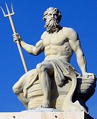
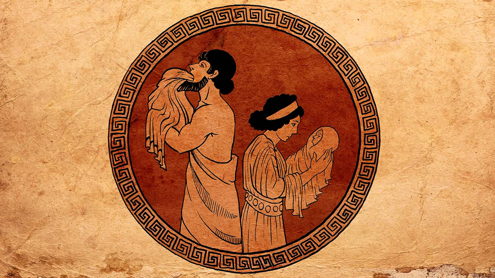

Poseidon
========

Poseidon is the Greek god of the sea, earthquakes, and horses. Poseidon is the 
protector of seafarers and of many Hellenic cities and colonies. Poseidon was 
also the central god of many cities in ancient Greece including the major 
city-state of Corinth.

Birth of Poseidon
~~~~~~~~~~~~~~~~~
Poseidon was the second son of the titans Cronus and Rhea. Poseidon was said to 
have been swallowed by Cronus shortly after his birth and was later saved by 
his brother, Zeus. The image below depicts a different perspective on the birth 
of Poseidon. Since Cronus was notorious for devouring his children as they were 
born, Rhea made the decision to try to conceal her second born son, Poseidon, 
by hiding him in a flock of lambs and telling Cronus that she had given birth 
to a colt. Cronus devoured the colt and never noticed Poseidon. Cronus then 
searched for Poseidon for a lengthy amount of time but could not find Poseidon 
because he was being raised by the Telchines on Rhodes.

Poseidon's Children
~~~~~~~~~~~~~~~~~~~
According to myth, he wed Amphitrite, a nymph and sea-goddess. Poseidon was 
father to the hero Theseus (the founder of Athens), Pelias and Neleus (twins), 
Nauplius, Atlas, etc. Poseidon had eighty or more lovers who, altogether, 
produced more than one hundred children.

Poseidon's Symbols
~~~~~~~~~~~~~~~~~~
Poseidon has five symbols that represent him:

* Horse
* Trident
* Bull
* Seafoam
* Dolphin