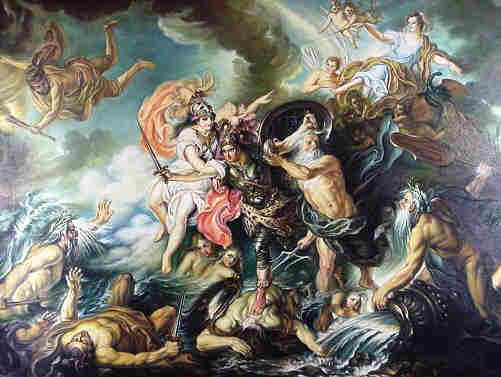

Zeus
====

.. image:: zeus.jpg 
	:width: 50%

Zeus is the Greek god of the sky and the overall ruler of all of the ancient Greek gods. Zeus is usually depicted as a large man with long hair and a long beard. He holds a lightning bolt in one hand which he throws at others that displease him. He also wears a toga (Greek clothing) of unspecified color. Zeus was named the ruler of the gods because he overthrew his father, Cronus, who was the original ruler of Olympus (the home of the gods). Zeus won a sort of "drawing" between his two brothers, Poseidon and Hades, and himself to become the ruler of the gods and the lord of the sky and the rain. 

Birth of Zeus
~~~~~~~~~~~~~
Zeus is the youngest son of the titan Cronus and his wife Rhea. In most myths Zeus was hidden in a cave by his mother Rhea in order to avoid being devoured by Cronus. After Zeus had grown up he returned to his father Cronus and made him regurgitate Zeus' previously devoured siblings. After doing so, Zeus and his siblings fought Cronus *and* the other titans for control over the universe.

Zeus' Children
~~~~~~~~~~~~~~
Zeus was husband to Hera, greek goddess of the hearth, and fathered many children indluding:

* Apollo
* Aphrodite
* Ares
* Artemis
* Athena
* Dionysus
* Perseus
* Heracles
* Hermes
* Hephaestus
* Minos
* the Muses

and many more.

Very many of Zeus' children were also gods.

Zeus' Symbols
~~~~~~~~~~~~~
Zeus is symbolized by the following:

1. Thunderbolt
2. Scepter
3. Eagle
4. Bull
5. Oak Tree
6. The Aegis (a shield)